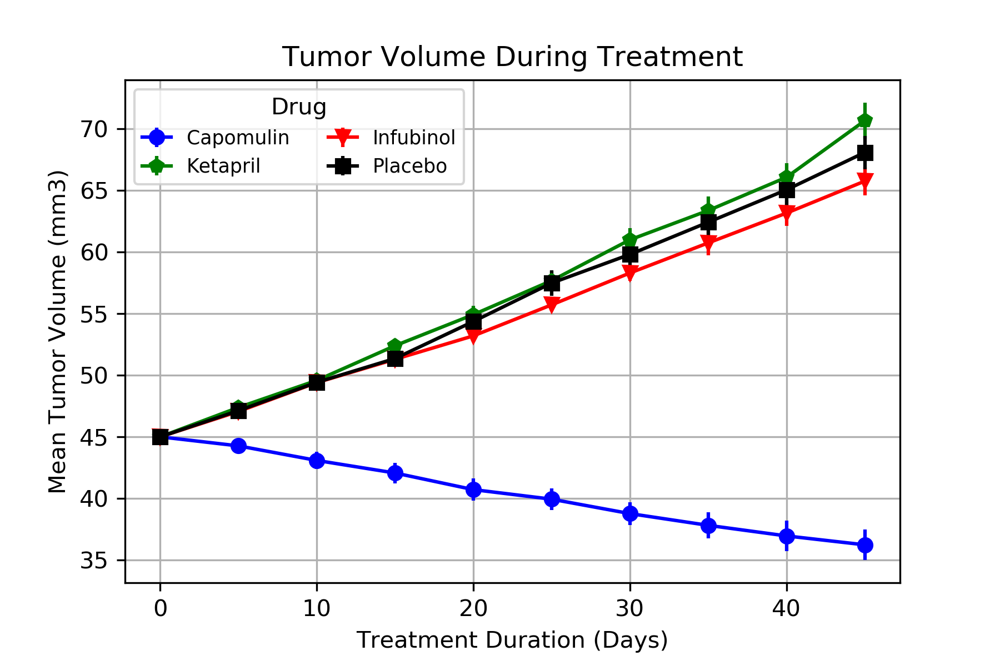
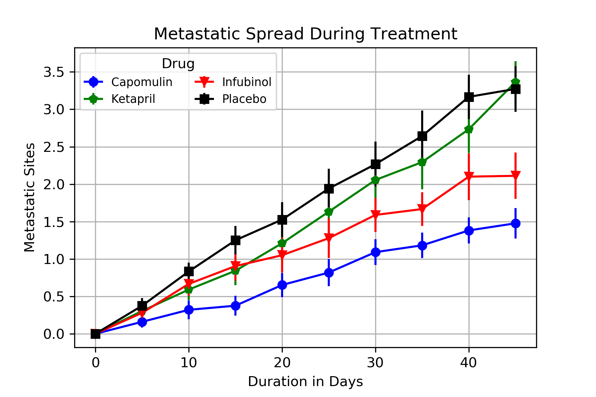
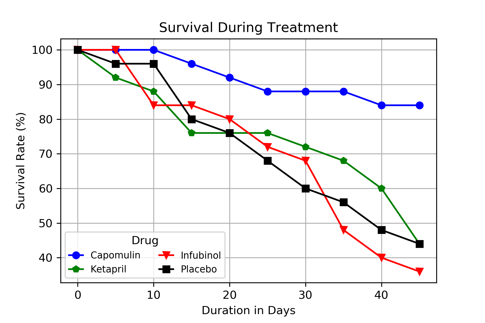
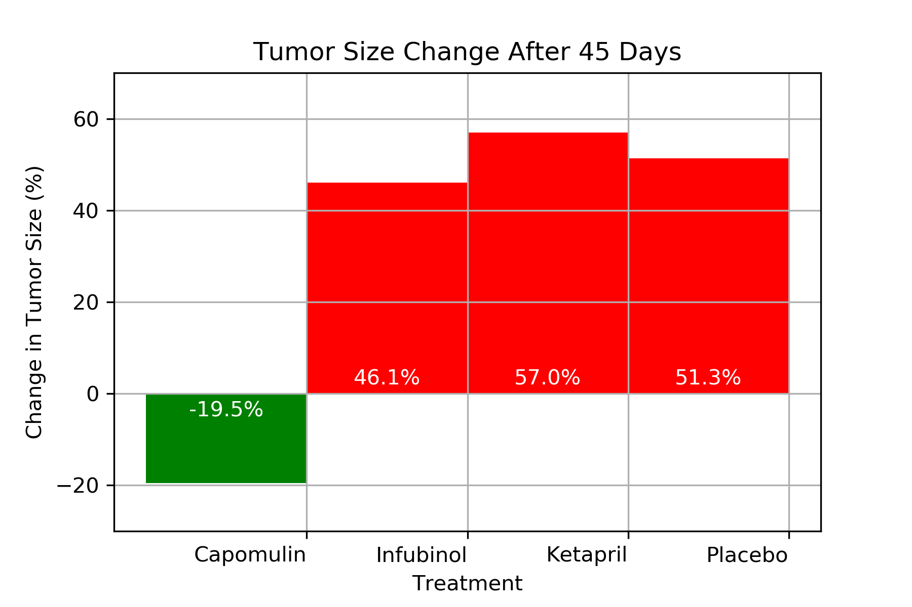

pymaceuticals.ipynb
The code will generate various data dictionaries within Jupyter notebook and export four figures.

Results:

This chart shows the response of tumors to the selected drugs over 45 days, measured by the size of the tumors in cubic milimeters
Of the selected drugs, only treatment with Capomulin resulted in a decrease in tumor volume.  
Ketapril and Infubinol had effects comparable to the placebo.

This chart shows the mean quantity  of metastatic sites on the subjects over 45 days.
Both Infubinol and Capomulin reduced the spread of metastatic sites in the subjects, with Capomulin once again performing best.
Between Ketapril and Capomulin, Capomulin showed more consistent results, with a narrower Standard Error of the Mean.

This chart shows the survival rate of subjects receiving each selected drug.
Again, Capomulin performed best: subjects receiving Capomulin had significantly higher rates of survival than those on Ketapril or placebo treatment.
Within this study, Infubinol's benefits in reducing metastatic sites do not appear to have helped improve the survival of the subjects.

This chart shows total mean change in tumor size of subjects receiving each selected drug from the beginning of the study to its conclusion.
Capomulin is the only treatment that resulted in a mean reduction in tumor size.  Ketapril and Infubinol each produced results within 6% of the placebo.

Out of the three drugs analyzed in this report, Capomulin has showed the most obviously positive results.
Ketapril and Infubinol produced effects comparable to placebo treatment.
